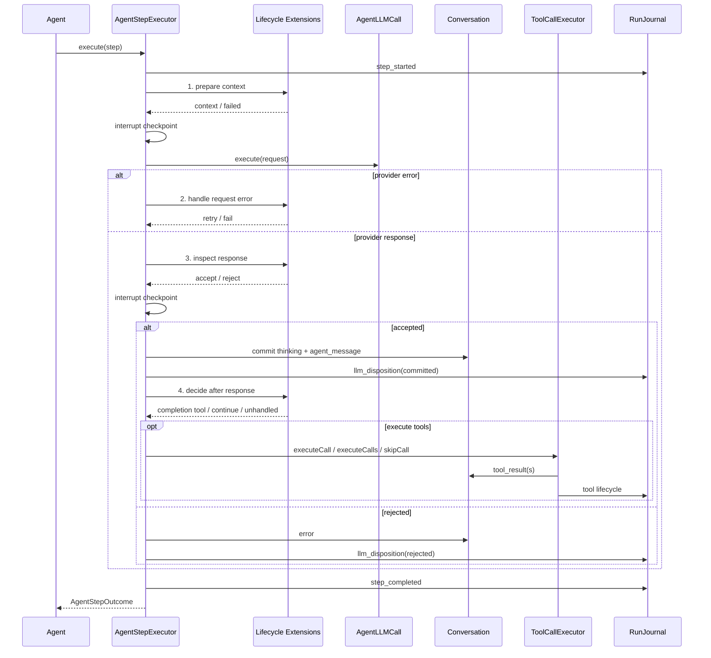
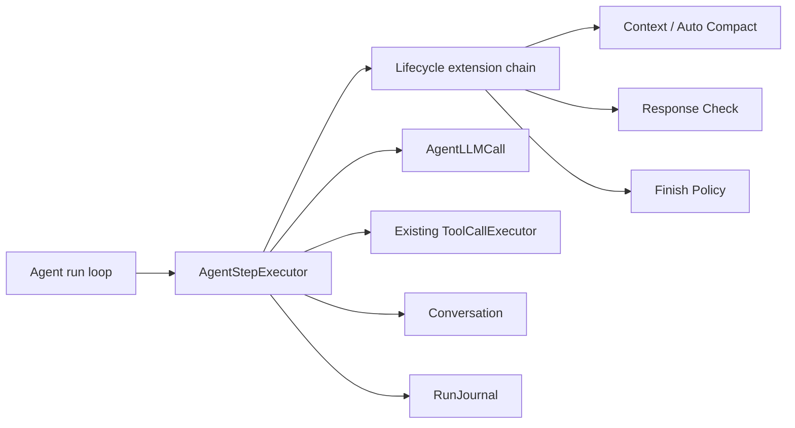

# Agent Loop 生命周期扩展

> 状态：历史方案，已由 `agent-module-refactor.md` 的职责收敛方案取代
> 类型：Agent 内核架构调整；新增内部事件，不改变公共协议
> 日期：2026-08-28

> 说明：本文保留第一次生命周期重构的决策背景。当前实现不再存在聚合
> `AgentLifecycle`；现行模块边界以 `agent-module-refactor.md` 为准。

## 1. 背景与目标

Tinyhands 当前已经把一个 ReAct run 拆为 `Agent`、`AgentStepExecutor`、
`AgentLLMCall` 与 `ToolCallExecutor`，但单步中的策略仍直接写在
`AgentStepExecutor`：

- step 开始时直接调用 `ContextCompactor.prepare()` 构建上下文并决定是否压缩；
- provider error 直接沿固定分支终止；
- `max_tokens`、`content_filter`、`refusal` 的响应检查由本地函数写死；
- `finish` 的优先执行、其他工具跳过、参数错误重试与纯文本提醒均写死；
- Loop 生成的完成提醒被伪装为 `source: "user"` 的 `user_message`。

这些行为目前正确，但继续增加模型重试、请求修饰或新的停止策略时，只能继续修改
ReAct 主控制流。最终会使“固定执行机制”和“可变 Agent 策略”再次耦合，也会让未来的
插件化改造触碰 Conversation 提交、中断竞态和工具配对等正确性边界。

本次重构的目标是：

1. 将 ReAct Loop 固定为不可绕过的执行骨架，只负责生命周期顺序与事实提交。
2. 在四个确定位置执行每 Session 独立、强类型的行为扩展；不同位置采用与其语义匹配的组合规则。
3. 把 Context、Auto Compact、响应检查和 Finish 判断迁为首批内置扩展。
4. 扩展只返回阶段决定，不直接写 Conversation Event 或 Run Log。
5. 用内部 `context_message` 记录 Loop 注入内容，不再伪造真人消息。
6. 本轮当时保持公共 protocol、Host、SDK 与 ToolCallExecutor 行为不变；后续权限与
   Human Interaction 变更见 `tool-policy-human-interaction.md`。

### 1.1 非目标

- 不设计 Tool Pipeline、工具执行前后扩展、权限审批或工具结果裁剪。
- 不开放第三方插件注册 API，也不承诺扩展接口的包级兼容性。
- 不引入 Agent Definition、subagent、动态加载或插件依赖图。
- 不允许扩展重排 run/step、绕过 interrupt 或自行提交持久事实。
- 不修改工具串行执行以及“执行中的工具等待自然结束”的语义。
- 不改变 Auto Compact 的阈值、摘要算法和 checkpoint 结构。

## 2. 固定机制与可变策略

### 2.1 固定机制

以下职责决定事件真相源与运行日志是否一致，必须由 Loop 强制执行：

- `run_started` 与 `run_completed/run_recovered` 的闭合；
- `step_started` 与 `step_completed` 的闭合；
- 固定事件快照、`projectedThroughSeq` 与 trigger 归属；
- interrupt 检查和 `AbortSignal` 传播；
- `llm_started/completed/failed` 与 `llm_disposition` 的提交顺序；
- provider 已返回、但响应尚未提交时发生 interrupt 的 discard；
- thinking 与 agent message 的原子提交顺序；
- 调用 ToolCallExecutor，并保证每个 tool call 最终得到 tool result；
- 将扩展返回的决定转换为 Event、Run Log 和 `AgentStepOutcome`。

扩展可以请求“重试、拒绝、继续”或指定 completion tool，但不能自行执行工具、宣告完成
或完成上述事实转换。

### 2.2 可变策略

以下行为可以在不破坏固定机制的前提下替换：

- 如何从事件快照构建模型请求；
- 何时执行 Auto Compact；
- provider error 后重试还是失败；
- provider 正常返回的响应是否可信；
- 响应提交后是继续、执行普通工具还是执行 completion tool；
- 纯文本未 finish 时补充什么上下文。

## 3. 生命周期时序



固定顺序不可由扩展修改，但四个位置不强行使用同一种链式协议：

- Context Preparation 是单一 Provider，避免多个扩展争夺模型请求所有权；Context 构建与
  Auto Compact 在该 Provider 内部组合。
- Request Error 是有序 Resolver 链，第一个明确返回 `retry/fail` 的 Resolver 生效。
- Response Inspection 是有序 Validator 链，全部通过才接受，第一个拒绝立即终止。
- Committed Response 是有序 Policy 链，第一个返回执行计划的 Policy 生效；都不处理时
  才执行默认普通工具分支。

该差异是阶段语义的一部分，不能用一个通用 `HookContext` 或通用 `Decision` 抹平。

## 4. 四个扩展位置

### 4.1 准备模型上下文

Context Preparation 是单一 Provider。输入只包含构建上下文实际需要的数据：当前 step
的只读事件快照、用于 token 估算的工具列表、压缩日志所需的 run/step 身份以及
`AbortSignal`：

```ts
interface PrepareContextInput {
  events: readonly Event[];
  tools: readonly Tool[];
  runId: string;
  step: number;
  signal?: AbortSignal;
}

interface PreparedContext {
  messages: Message[];
  systemContext: string[];
}
```

`PreparedContext` 只保留两个真正属于上下文构建结果的字段：

- `messages`：发送给模型的对话投影；
- `systemContext`：发送给模型的系统级上下文，包括压缩摘要。

其余数据不进入返回值：`tools` 仍由 `ToolRegistry` 提供；`projectedThroughSeq` 仍由
Step 根据固定事件快照计算并用于 Run Log；`estimatedInputTokens` 仅是 Compactor 的内部
计算值。Step 最终用这三处数据自行组装 `AgentLLMCallInput`。

内置 Context Preparation Provider 在内部按以下顺序运行：

1. Context 构建：应用最新 checkpoint，投影 `Message[]`，附加仍有效的
   `context_message`。
2. Auto Compact：检查预算；需要压缩时调用现有压缩事务，写完 checkpoint 后重新投影。

Auto Compact 仍只能通过 Provider 私有持有的现有 Conversation/RunJournal 能力提交压缩
生命周期；该写能力不出现在 `PrepareContextInput` 中。准备阶段失败时，Step 闭合为
`error`，不得继续调用 LLM。

### 4.2 模型请求失败后

仅处理 `AgentLLMCall` 已经写入 `llm_failed(provider_error)`、且固定重试上限仍有剩余额度
的情况。abort 不进入该位置。Resolver 只读取失败对象与当前调用序号：

```ts
interface ModelRequestFailure {
  error: unknown;
  attempt: number; // 从 1 开始
}

type RequestErrorDecision =
  | "retry"
  | "fail";

type RequestErrorResolver = (
  failure: Readonly<ModelRequestFailure>
) => Promise<RequestErrorDecision | undefined>;
```

Resolver 按注册顺序执行，第一个返回 `retry` 或 `fail` 的结果生效；全部返回
`undefined` 时默认 `fail`。不传 `runId`、`step`、`llmCallId` 或最大次数，因为它们不参与
当前决策；重试额度由固定 Loop 强制执行。默认 `maxModelAttemptsPerStep = 1`，所以本次
重构保持现有“不重试”行为。未来提高上限时，才会实际进入 Resolver 链。

### 4.3 模型响应提交前

第一版检查只依赖 `stopReason`，因此 Validator 不读取完整 `LLMResponse`，更不能修改
响应。通过用 `undefined` 表示，只有拒绝才返回数据：

```ts
interface ResponseRejection {
  reason: "max_tokens" | "content_filter" | "refusal";
  message: string;
}

type ResponseValidator = (
  stopReason: LLMResponse["stopReason"]
) => Promise<ResponseRejection | undefined>;
```

Validator 按注册顺序执行，第一个返回 `ResponseRejection` 时停止；全部返回
`undefined` 才接受响应。现有 `max_tokens/content_filter/refusal` 判断迁入内置 Response
Check Validator。拒绝时由 Step 提交公开 `error` 和 `llm_disposition(rejected)`；扩展
自身不写事件。未来确有检查 text 或 tool calls 的需求时再显式扩大输入，不提前暴露
usage、provider replay 或 thinking blocks。

### 4.4 模型响应提交后

该位置发生在 thinking、agent message 和 committed disposition 全部落盘之后、普通工具
执行之前。第一版 Finish Policy 只需要查看工具调用：

```ts
interface CommittedResponseInput {
  toolCalls: readonly ToolCall[];
}

type CommittedResponsePlan =
  | {
      type: "continue";
      contextMessage: string;
    }
  | {
      type: "execute_completion_tool";
      toolCallId: string;
      onErrorContextMessage: string;
    };

type CommittedResponsePolicy = (
  input: Readonly<CommittedResponseInput>
) => Promise<CommittedResponsePlan | undefined>;
```

Policy 按注册顺序执行，第一个返回计划的 Policy 生效。全部返回 `undefined` 且存在普通
tool calls 时，Step 默认调用现有 ToolCallExecutor 执行全部调用；全部未处理且 tool calls
为空属于装配错误，fail-closed，避免无上下文变化的死循环。

这里有意删除了原草案中的冗余状态：

- `execute_tools` 是未匹配任何特殊 Policy 后的默认机制，不需要返回；
- `skipOtherCalls: true` 已由 `execute_completion_tool` 的语义保证；
- `complete` 不能在工具执行前凭空决定，完成结果必须来自 completion tool 的成功结果；
- `fail` 当前没有合法内置场景，扩展异常由统一 fail-closed 处理；
- `contextMessage` 在 `continue` 中必须存在，否则下一轮输入没有变化，可能形成空转。

内置 Finish 扩展保持现有语义：

- 找到 finish 时返回 `execute_completion_tool`；Step 用 ToolCallExecutor 执行 finish，并以
  `finish_called` 跳过同轮其他工具。
- finish 执行成功后，Step 提交 `agent_completed` 并返回 completed。
- finish 参数或执行结果错误时，Step 使用计划中的 `onErrorContextMessage` 写入
  `context_message`，下一 Step 继续。
- 没有任何工具调用时，Step 写入 `context_message`，下一 Step 继续。
- 只有普通工具调用时返回 `undefined`，由固定默认分支执行。

## 5. 扩展实例与失败语义

### 5.1 每 Session 实例

Host 内部装配 factory；`makeAgentSessionFactory()` 每创建一个 Session，就创建一个新的
Context Preparation Provider，以及新的 Resolver、Validator 和 Policy 实例。实例不得跨
Session 共享可变状态。

每个组件有唯一字符串 ID。单个 Session 内发现重复 ID 时，Session 创建失败；Resolver、
Validator 和 Policy 不通过优先级或依赖拓扑重排，顺序完全由注册顺序决定。Context
Preparation 只能装配一个，缺失或重复均在 Session 创建时失败。

### 5.2 输入和决定

- 输入均为新建的只读对象或快照，不传递可变 Conversation、RunJournal 或 Runtime。
- 扩展不能直接追加事件、开始工具调用或改变 interrupt 状态。
- 每个位置只接受本节定义的最小输入与决定类型，不提供通用可变 lifecycle context。
- 扩展收到当前 run 的 `AbortSignal`，内置实现必须在异步操作中传播它。

### 5.3 失败

- 扩展抛错或返回非法决定时 fail-closed：Step 记录 `step_completed(error)`，Run 进入
  `error`，并由现有 Session 驱动提交稳定的公开 error。
- 扩展错误不得包含 provider 原始响应、密钥、prompt 或工具正文等敏感信息。
- 响应提交前失败时，不提交任何 response event。
- 模型已经正常返回、但 Response Validator 失败时，固定机制写入
  `llm_disposition(discarded, lifecycle_error)`，闭合该次模型调用。
- 响应已经提交后失败时，不回滚事实；若已存在待执行 tool calls，Step 必须使用现有
  ToolCallExecutor 为它们写入 `lifecycle_error` 的配对 skipped result 后再结束，避免投影留下
  开放窗口。
- 本轮不增加扩展独立超时；取消只依赖现有 `AbortSignal`。外部插件隔离与超时属于未来
  公共插件设计。

## 6. `context_message`

### 6.1 事件形状

`context_message` 是内部持久事件，不是新的 LLM role：

```ts
type ContextMessageEvent = BaseEvent & {
  type: "context_message";
  source: "environment";
  text: string;
};
```

它表示 Agent Loop 为下一次模型调用追加的一次性 user-role 上下文。

### 6.2 投影规则

事件序列：

```text
agent_message(seq=N)
context_message(seq=N+1)
```

只要其后尚未提交新的 `agent_message`，Context 构建就把它投影为：

```ts
{ role: "user", text: event.text }
```

下一条 `agent_message` 提交后，旧 `context_message` 不再进入后续模型请求，但原事件仍
保留在 `events.jsonl` 中。该规则由事件序列纯投影得到，不新增 consumed 事件。

因此：

- provider error、提交前 interrupt 或调用过程中崩溃时，它在下一次请求中仍有效；
- 模型响应一旦成为新的 `agent_message`，它即完成作用；
- 后续再次出现纯文本未 finish 时，Finish 扩展会写入一条新的 `context_message`。

### 6.3 可见性和压缩

- `toPublicEvent()` 必须隐藏 `context_message`；历史补发和实时订阅都不暴露。
- protocol、SDK 和公开 `PublicEvent` 不新增该类型。
- Context Compactor 不把 `context_message` 写入摘要；完成压缩后再附加仍有效的消息。
- `user_message` 此后只允许表示真实用户输入。

## 7. 模块边界与依赖



边界约束：

- `Agent` 只负责 Run 级循环、最大 Step 数和 `RunResult` 组装。
- `AgentStepExecutor` 负责单个 Step 的固定事务顺序，不包含具体策略。
- 生命周期扩展依赖中性 Agent/LLM/Tool 类型，不依赖 server transport。
- 内置 Context/Compact 扩展可以依赖专用 ContextCompactor 能力，但不把该能力暴露给
  通用扩展接口。
- ToolCallExecutor 本轮不改造；未来 Tool Pipeline 只替换 `execute_tools` 分支内部实现，
  不改变本设计的四个 Agent Loop 位置。
- 新接口保持 server-internal，不从 `@tinyhands/server` 根入口导出。

## 8. 风险与失败处理

| 风险 | 处理 |
| --- | --- |
| 扩展绕过持久化顺序 | 不提供 Conversation/RunJournal 写能力；只接受阶段决定 |
| 扩展顺序导致不可复现 | 明确定义各位置的组合规则；有序链按注册顺序执行，拒绝重复 ID |
| 多个 Context 扩展争夺请求所有权 | Context Preparation 只允许一个 Provider，内部组合 Context 与 Compact |
| 扩展失败后继续运行 | 行为扩展统一 fail-closed |
| interrupt 后提交旧响应 | 提交前 checkpoint 保留在固定机制中，不允许扩展移除 |
| context_message 永久污染上下文 | 仅在其后没有新 agent_message 时投影 |
| context_message 被误展示为用户发言 | 内部事件不进入 Public View |
| 压缩吸收 Loop 提示 | Compactor 明确忽略 context_message，投影阶段后置附加 |
| Finish 扩展失败留下开放 tool call | 固定 Step 使用 ToolCallExecutor 补齐 skipped result |
| 提前设计 Tool Pipeline | 本轮保持 ToolCallExecutor 原实现与接口 |

## 9. 测试与验收

### 9.1 生命周期

- 四个位置按固定顺序调用。
- Context Preparation 缺失或重复时 Session 创建失败。
- Request Error 采用 first-decision Resolver 语义，未处理时默认 fail。
- Response Inspection 采用 all-pass Validator 语义，第一个拒绝立即终止。
- Committed Response 采用 first-plan Policy 语义，普通工具调用走默认分支。
- 两个 Session 的扩展实例和状态互不影响。
- 重复扩展 ID 在 Session 创建阶段失败。
- 任一位置抛错或返回非法决定时，step/run 正确闭合。

### 9.2 既有行为

- Context 与 Auto Compact 迁移前后使用相同事件快照、水位线和阈值。
- `max_tokens/content_filter/refusal` 仍拒绝且不提交响应事实。
- provider error 与 abort 的 Run Log 顺序保持不变。
- finish 成功、参数错误、纯文本响应、同轮其他工具跳过语义保持不变。
- ToolCallExecutor 的串行、interrupt 和配对测试保持不变。

### 9.3 `context_message`

- 成功落盘并可在进程重启后加载。
- 不进入公共历史、实时 SSE/WS 或 SDK。
- 下一次请求投影为 user role。
- 下一条 agent message 提交后不再投影。
- provider error、提交前 interrupt 或崩溃恢复后继续投影。
- 不进入 compact summary。

### 9.4 回归

- 运行 `npm test`，现有 typecheck 和全部测试必须通过。
- 运行 `npm run verify:crash`，确认崩溃恢复不受内部事件影响。
- 运行 `npm run verify:compact`，确认真实压缩链路仍可完成并恢复。

## 10. 实施顺序

1. 用 characterization tests 锁定当前 step、finish、响应拒绝、interrupt 和 compact 顺序。
2. 增加内部 `context_message` 事件、投影和公开视图过滤测试。
3. 建立每 Session 生命周期组件与四个强类型位置，并实现各位置不同的组合规则。
4. 迁移 Context/Auto Compact、Response Check、Finish 三组内置扩展。
5. 收敛 `AgentStepExecutor`，删除迁出后的硬编码策略。
6. 完成全量测试、crash recovery 与 compact smoke verification。
