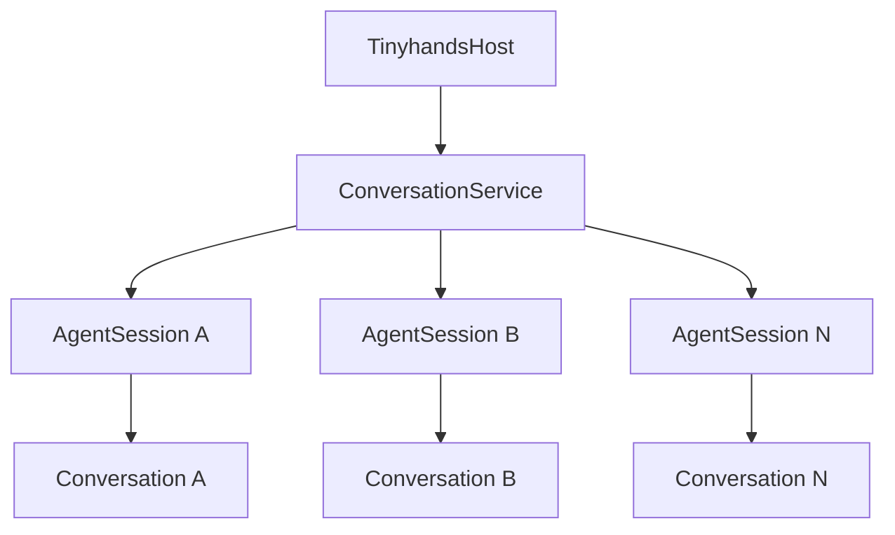
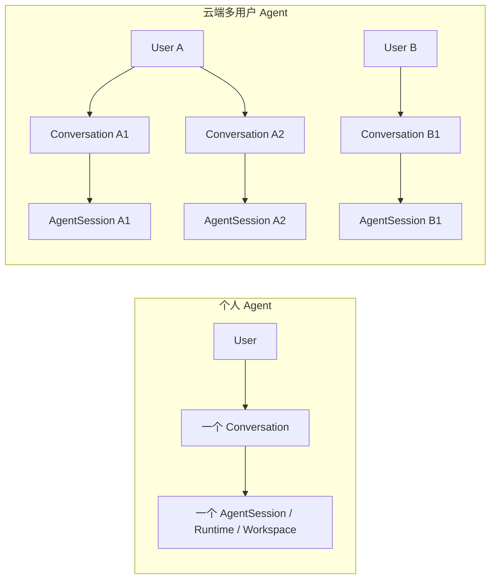
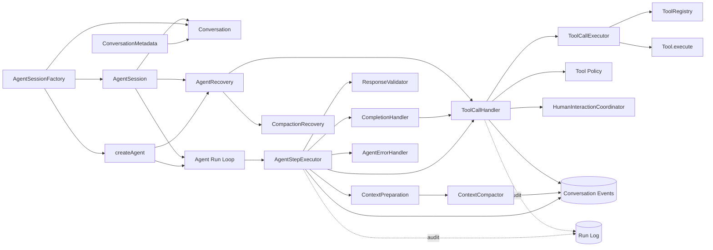
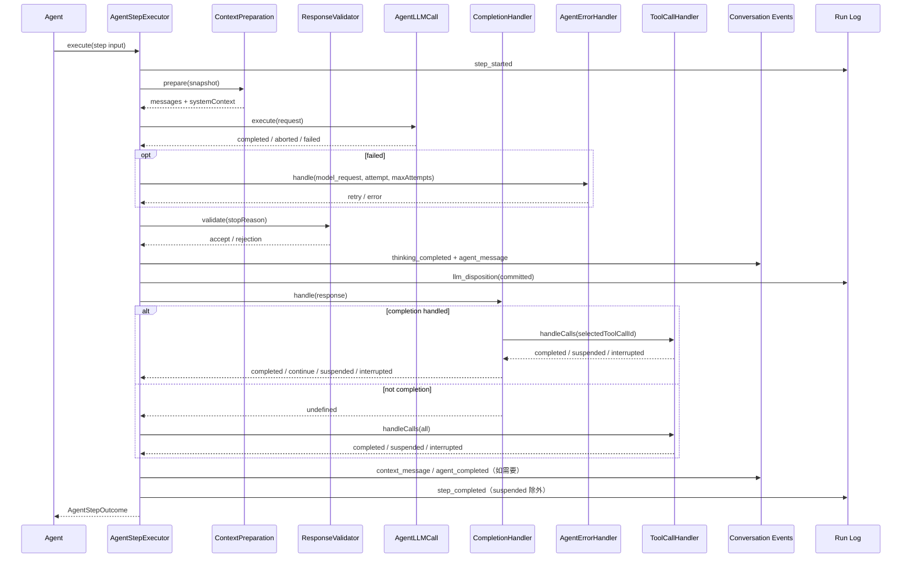
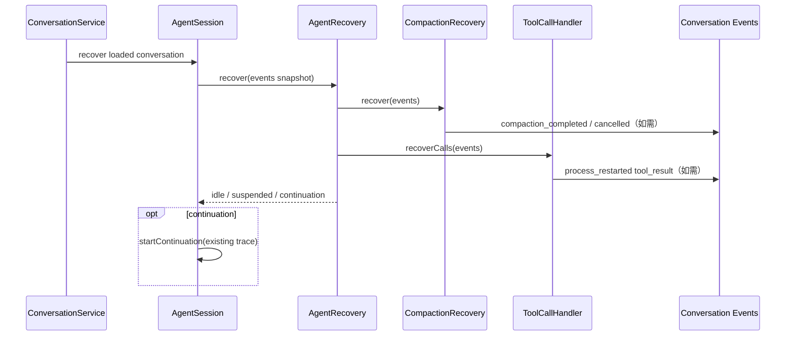
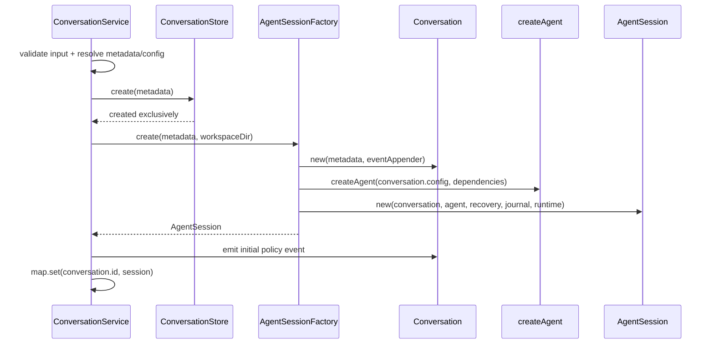

# Agent 模块职责收敛重构

> 状态：已确认并实施
> 类型：Agent 模块架构重构
> 日期：2026-09-01

## 1. 背景与审查结论

本期审查范围从 `AgentStepExecutor` 扩展到整个 `packages/server/src/agent/`。
已验证的当前规模是 6 个生产文件约 2280 行，4 个测试文件约 1500 行。
问题不在于单个文件太长，而在于不同领域状态机被堆到同一类中，且恢复规则泄漏到
`server/` 层。

| 现有文件 | 已验证问题 | 本期结论 |
|---|---|---|
| `agent.ts` | 同时负责 Run 循环、默认组件装配、创建 approval coordinator | 只保留 Run 循环；装配移到 `create-agent.ts` |
| `agent-step.ts` | 658 行，execute/resume 重复，并混合 Context、LLM、commit、finish、ToolCall 和错误收尾 | 改为 Step 固定骨架，其他行为交给独立组件 |
| `agent-lifecycle.ts` | 352 行聚合四个不同领域；Request Error 和 Committed Response 的生产扩展链实际为空 | 删除聚合容器；只保留真实存在的 Context/Response 扩展位置 |
| `agent-llm-call.ts` | 单次 Agent LLM 调用边界清晰，但失败原始异常会继续上抛 | 保留单次调用边界，返回受控 outcome，不抛 Provider 异常 |
| `tool-call-executor.ts` | 同时做 schema、Policy、approval、Event、Run Log、串行批次与恢复 | 拆成 Handler、Executor 和纯状态归约 |
| `context-compactor.ts` | 688 行混合预算、边界、投影、摘要协议、LLM、Event、Run Log 和失败恢复 | 迁入 `context/`，拆出纯计算、摘要调用和恢复规则 |
| `server/agent-session.ts` | 既复制 Conversation 身份/创建时间，又把执行状态藏入 WeakMap，并在同文件混合装配、驱动、恢复与关闭 | 保留为单 Conversation 活跃执行控制器；删除数据副本，显式持有私有运行状态，装配移出该文件 |
| `conversation-service.ts` 相关段落 | 直接解释 orphan ToolCall、dispatch barrier 和 Compaction 终态 | Service 只调用 AgentSession 恢复入口，不再理解 Agent 状态机 |

### 1.1 现有 Step 问题

当前 `AgentStepExecutor` 同时负责事件快照、上下文准备、无生产配置的模型重试分支、响应校验、模型响应
提交、完成判断、ToolCall 执行、approval 暂停以及已提交响应恢复。正常执行和恢复路径还
重复了一整段 finish/ToolCall 处理代码。

现有 `inspectResponse()` 实际只校验 `stopReason`，`planCommittedResponse()` 实际只选择
当前响应的立即处理方式；`inspect`、`plan` 扩大了语义范围，也让 Step 主流程更难阅读。

本次目标：

1. `AgentStepExecutor` 只保留一个 Step 的固定顺序和 Conversation/Run Log 事实提交。
2. `CompletionHandler` 负责当前 Agent 的完成协议，首个实现继续使用 `finish`。
3. `ToolCallHandler` 负责整个 ToolCall 批次的策略、approval、事件、审计和恢复副作用。
4. `ToolCallExecutor` 只负责 `prepare()`、执行 Tool、返回结果。
5. 正常响应与恢复响应共用同一个已提交响应处理入口，删除重复分支。
6. 使用项目已有语义：`handle`、`validate`、`continue/completed/suspended/interrupted`；
   不再引入 `plan`、`inspect` 或另一套阶段名。
7. 删除没有生产数据来源的 `RequestErrorResolver` 扩展链，由固定的
   `AgentErrorHandler` 接管每次模型失败、重试判断和最终错误收敛。
8. 新建 `agent/step/` 目录，每个 Handler 独立文件，不再把所有 Step 逻辑平铺在
   `agent/` 根目录。
9. 保留 `AgentSession` 作为当前进程中的执行控制器，但让 Conversation 自己持有 metadata；
   `AgentSession` 不再复制 `conversationId/conversationCreatedAt`，也不再使用模块级 WeakMap。

### 1.2 非目标

- 不开放公共 Tool Pipeline、Hook 或第三方注册 API。
- 不实现 Agent Definition、Plan Agent 或 subagent。
- 不改变公共 protocol、Host、SDK、HTTP 或 SSE 事件。
- 不公开内部 `tool_call_dispatched`。
- 不改变 Tool Policy、Human Interaction、interrupt 和 Auto Compact 的现有业务语义。
- 不增加公共模型重试配置；默认 `maxModelAttemptsPerStep = 1`，保持当前生产行为。

### 1.3 多租户与 Conversation 隔离边界

本次不修改现有多会话模型，也不在 Tinyhands 内新增 `Tenant`、`User` 或业务
`Session` 实体。Tinyhands 是 tenant-agnostic 的执行内核：上层业务保存
`User/Tenant -> Conversation[]` 关系，并在调用 Host 前完成身份认证与
Conversation ownership 校验；Tinyhands 只接收已经授权的 `conversationId`。

现有基数保持不变：



- 一个 Host 拥有一个 `ConversationService`，可管理多个 Conversation。
- 同一 `conversationId` 在一个 Host 内至多有一个 resident `AgentSession`。
- 一个 `AgentSession` 只驱动一个 Conversation；它是进程内执行实例，不是用户登录
  Session，也不是租户聚合。
- Conversation 是持久身份和最小状态隔离单元；进程重启后可绑定新的
  `AgentSession`。

同一模型支持两种部署拓扑：



Tinyhands 按 `conversationId` 隔离 Conversation Events、Message 投影、Run Log、
Context/Compact、Run/Step、interrupt、approval、Runtime、Workspace 以及 Conversation
策略状态。Provider client、Tool 定义、Store 和 Host 默认配置可以在 Host 内共享。

边界条件：

- 上层必须先校验用户对 `conversationId` 的 ownership，不能把 Tinyhands 的
  `get/submit/events` 当作鉴权边界。
- `conversationId` 必须由可信服务端生成或保证在该 Host 数据域内唯一。
- Conversation 级逻辑隔离不等于不可信代码的安全隔离；Tool 可执行不可信代码时，仍由
  Runtime 的容器、文件系统、网络和资源限制提供安全边界。
- 当前语义是“一个 Conversation 一个 Runtime”。一个用户拥有多个 Conversation 时，默认
  对应多个隔离 Runtime；多个 Conversation 共享用户级 Runtime 不属于本期能力。

## 2. 当前问题

`AgentStepExecutor.execute()` 当前依次完成七类工作，却把策略和机制穿插在一个方法中：

1. 固定事件快照并开启 Step Run Log。
2. 构建 Context 和 Auto Compact。
3. 调用 LLM、进入当前实际不可达的 provider error 重试分支。
4. 检查不可信响应并决定 commit/discard。
5. 提交 thinking 和 `agent_message`。
6. 识别 `finish`、追加纯文本提醒或选择普通工具。
7. 执行 ToolCall、处理 approval、闭合 Step。

具体职责泄漏：

- `AgentStepExecutor` 直接查找和执行 `finish`，并逐个补其他 ToolCall 的 skipped result。
- `requestErrorResolvers` 没有生产装配入口，`maxModelAttemptsPerStep` 默认又是 1；真实服务
  在调用 resolver 前就已达到上限，这条重试扩展链只存在于测试构造中。
- `ToolCallExecutor` 直接读取 Conversation Event，执行 Policy、创建 approval、写 Event 和
  Run Log，并通过 `suspended` 参与 Agent continuation。
- `ConversationService` 直接理解 orphan ToolCall、`tool_call_dispatched` 和 approval 恢复。
- `execute()` 与 `resumeCommittedResponse()` 重复完成判断和 ToolCall 分支。
- Context 准备的 interrupt 同时依赖异常和 `signal.aborted`，同一收尾代码出现两次。
- `Agent` 自己 new `AgentStepExecutor`、`AgentLLMCall`、`ToolCallExecutor` 和
  `HumanInteractionCoordinator`，导致 Run 循环与装配职责绑定。
- `ContextCompactor.prepare()` 的 `estimatedInputTokens/compacted` 只被测试观察，
  生产调用者立即丢弃，是多余输出。
- `ContextCompactorLike` 只是为测试替身建立的二次接口；Context Preparation
  本身已经是可替换边界。
- Agent LLM 失败在默认最大尝试次数为 1 时直接 throw，绕过
  `resolveRequestError()`；Session 最外层又将原始异常 message 写入公共 error 事件。
- ToolCall 与 Compaction 的进程崩溃恢复规则位于 `ConversationService`，
  造成 Service 必须知道 Agent 内部事件配对和 barrier 语义。

### 2.1 参数透传审查

参数多不是本质问题；本质是生命周期更长的依赖被当成每次调用参数不断下传。
审查结果：

| 当前参数 | 真实生命周期 | 结论 |
|---|---|---|
| `conversation` | Conversation 执行实例固定 | 在 `createAgent()` 时绑定；从 `Agent.run`、Step 和 Handler 方法参数删除 |
| `runtime` / `ToolContext` | Conversation 执行实例固定 | Runtime 依旧惰性 start，但对象可在装配时绑定到 ToolCallHandler |
| `ToolRegistry` / `tools` | Conversation 执行实例固定 | Registry 只注入 Executor；给 LLM/Compactor 的 Tool 快照在装配时计算一次 |
| `RunJournal` / logger / policy getter | Conversation 执行实例/Host 依赖 | constructor 注入对应组件，不作为 handle/execute 参数 |
| `maxStep` / `maxModelAttemptsPerStep` / Auto Compact | Conversation effective config | 创建时解析、持久化，装配时分发给需要的组件 |
| `retryable` | 单次错误 | 收进 `LLMRequestError`，不单独传递 |
| `attempt` | 单 Step 动态状态 | 保留为 model request failure 输入 |
| `runId` / `step` / `projectedThroughSeq` / `llmCallId` | Run/Step 动态坐标 | 统一为已有语义 `AgentExecutionTrace`，不转成全局隐式状态 |
| `signal` | 单 Run 动态取消能力 | 必须显式沿异步调用链传递；不存入 Conversation config |
| `events/response/toolCalls/error` | 当前阶段业务输入 | 保留显式传递，不从统一 config 反向查询 |

当前 `SessionFactory` 还同时接收 `conversationId`、`tools`、`initialRecord`，再在工厂内
按“新建参数 > record > 默认值”重新解析。这是第二条配置入口，本期删除：

```ts
type AgentSessionFactoryInput = {
  metadata: ConversationMetadata;
  initialEvents?: readonly Event[];
  workspaceDir: string;
};

type AgentSessionFactory = (
  input: AgentSessionFactoryInput
) => Promise<AgentSession>;
```

现有 `SessionFactory` 同时更名为语义完整的 `AgentSessionFactory`。新建与恢复都先得到完整
`ConversationMetadata`，Factory 不再处理配置优先级。

关键方法签名的收窄目标：

| 当前 | 目标 |
|---|---|
| `agent.run(conversation, { runId, runtime, signal })` | `agent.run({ runId, signal })` |
| `step.execute({ conversation, runId, runtime, step, signal, previousState })` | `step.execute({ runId, step, signal, previousState })` |
| `context.prepare({ events, tools, runId, step, signal })` | `context.prepare({ events, coordinates, signal })` |
| `compactor.prepare(events, tools, { runId, step, signal })` | `compactor.prepare({ events, coordinates, signal })` |
| `llmCall.execute({ runId, step, projectedThroughSeq, messages, systemContext, tools, signal, onDelta })` | `llmCall.execute({ request, coordinates, signal })` |
| `completion.handle({ response, conversation, context, trace, signal })` | `completion.handle({ response, trace, signal })` |
| `toolCalls.handle({ conversation, calls, context, trace, signal })` | `toolCalls.handle({ calls, trace, signal })` |
| `executor.execute(prepared, toolContext)` | `executor.execute(prepared)` |
| `error.handle({ ..., conversation, retryable, maxAttempts, runId, step, llmCallId })` | `error.handle(AgentErrorInput)` |

`coordinates/trace/request` 不是为了少写参数而创建的万能 bag：

- `coordinates` 只包含同一 Step 共享的 `runId/step/projectedThroughSeq`。
- `trace` 是项目已有 `agent_message.executionTrace` 的同一语义，额外包含 `llmCallId`。
- `request` 只包含已确认的 `messages/systemContext`。

额外删减项：

- `ContextCompactor.appendDisposition()` 当前接收 `signal` 后立即剔除，该无效参数删除。
- `AgentSession.submit/interrupt/close` 当前只把 `this` 传给同文件自由函数；
  迁移为 Session 私有方法，保留封装但减少无意义跳转。

## 3. 目标模块边界



### 3.1 `ConversationMetadata` 与 effective config

当前 `ConversationRecord` 不是 Conversation 聚合，也不是消息记录。它只是持久化到
`meta.json` 的静态 metadata DTO：

```ts
interface ConversationRecord {
  schemaVersion: 1;
  conversationId: string;
  createdAt: number;
  tools?: string[];
}
```

它目前只用于：

- 表示 Conversation 在磁盘上存在。
- `list()` 不加载全部 Event 即可返回 ID/createdAt。
- 恢复时重建当时选择的 ToolRegistry。

`Record` 语义过宽，且它并未保存完整 Conversation effective config。本期更名为
`ConversationMetadata`，并升级 metadata schema：

```ts
interface ConversationMetadata {
  schemaVersion: 2;
  conversationId: string;
  createdAt: number;
  config: ConversationConfig;
}

interface ConversationConfig {
  tools: ToolName[];
  maxSteps: number;
  maxModelAttemptsPerStep: number;
  autoCompact: AutoCompactConfig & { maxOutputTokens: number };
}
```

`ConversationMetadata` 是持久化 DTO，同时也是 Conversation 的不可变身份与配置值；
`Conversation` 才是进程内聚合对象，持有 metadata 与 EventStream：

```ts
class Conversation {
  readonly metadata: ConversationMetadata;

  constructor(
    metadata: ConversationMetadata,
    options: {
      eventAppender: EventAppender;
      initialEvents?: readonly Event[];
      logger?: TinyhandsLogger;
    }
  );

  get id(): string {
    return this.metadata.conversationId;
  }

  get createdAt(): number {
    return this.metadata.createdAt;
  }

  get config(): Readonly<ConversationConfig> {
    return this.metadata.config;
  }
}
```

- `conversationId`、`createdAt` 和固定配置只在 metadata 中保存一份。
- `Conversation` 暴露只读 getter，不把 metadata 字段复制成第二份可漂移状态。
- EventStream 继续是 Conversation Event 的唯一真相源；Run Log 不进入 Conversation，
  也不参与 Message 恢复。
- `toolPolicyMode` 等允许运行期切换的策略仍由 Conversation Event 表达，不写入不可变
  metadata。

配置解析只有一个入口：

```text
Host defaults + CreateConversationInput
                  ↓
       resolve effective config
                  ↓
       create ConversationMetadata
                  ↓
       persist metadata + new Conversation(metadata)
                  ↓
       create AgentSession + createAgent(conversation.config)
```

- `CreateConversationInput` 只贡献现有公开字段（例如 Tool 选择）；本期不借此新增
  `maxSteps`、模型重试或 Auto Compact 的公共 Conversation 配置入口。
- `maxSteps`、`maxModelAttemptsPerStep` 和 Auto Compact 从 Host 默认值解析后写入内部
  metadata，目的是让同一 Conversation 恢复时不因 Host 默认值变化而发生事实漂移；它们
  不是租户配置，也不会要求上层业务传入。
- 新建与恢复都使用持久化后的 effective config，不在深层组件重新 fallback。
- v1 metadata 第一次恢复时用当前 Host defaults 补齐缺失字段并原子升级为 v2；
  升级后不再随 Host 配置漂移。
- `toolPolicyMode` 允许 HTTP/WS 运行期切换，继续以 Conversation Event 为真相，
  不复制到不可变 metadata 中。
- API key、logger、Store、LLMClient、Runtime 实例和 Policy Getter 是 Host 能力依赖，
  不可序列化到 ConversationConfig。
- 不增加全局 `config.get(conversationId)` Service Locator。`createAgent()` 只在装配时读一次
  config，再把最小配置切片注入各组件 constructor。

`ConversationService.create()` 先生成唯一 metadata，再把同一个对象交给 Store、Conversation
和 AgentSessionFactory；禁止由 AgentSession 生成 `createdAt` 后再反向提供给 Service。
恢复时 Store 返回 `metadata + events`，据此创建全新的 Conversation 和 AgentSession；
进程内运行状态不序列化，也不从 Run Log 伪造恢复。

### 3.2 `AgentSession` 的保留边界

`AgentSession` 保留，但不再作为 Conversation metadata 的包装对象。它只表示“一个
Conversation 在当前 Host 进程中的活跃执行控制器”，负责无法从持久 Conversation
直接读取的进程内状态。

字段归属固定如下：

| 当前字段 | 目标归属 | 处理 |
|---|---|---|
| `conversationId` | `Conversation.metadata.conversationId` | 从 AgentSession 删除，统一读取 `conversation.id` |
| `conversationCreatedAt` | `Conversation.metadata.createdAt` | 从 AgentSession 删除，统一读取 `conversation.createdAt` |
| `conversation` | AgentSession 与持久状态的关联 | 保留唯一只读引用，不复制内部字段 |
| `agent` | AgentSession 私有执行资源 | 保留 |
| `journal` | AgentSession 私有审计依赖 | 保留；不得作为 Message/恢复事实源 |
| `runtime` | AgentSession 私有执行资源 | 保留并惰性启动 |
| `running/runAbort/drivePromise/lastInterruptSeq` | AgentSession 私有 driver 状态 | 保留，用于单 driver、interrupt 和 lost-wakeup |
| `closing/closePromise/runtimeStarted` | AgentSession 私有资源生命周期 | 保留，用于幂等关闭和 Runtime 生命周期 |
| `log` | AgentSession 私有依赖 | 保留 |

目标形态：

```ts
class AgentSession {
  readonly conversation: Conversation;

  readonly #agent: Agent;
  readonly #recovery: AgentRecovery;
  readonly #journal: RunJournal;
  readonly #runtime: Runtime;
  readonly #log: TinyhandsLogger;

  #running = false;
  #runAbort: AbortController | null = null;
  #lastInterruptSeq: number | null = null;
  #drivePromise: Promise<void> | null = null;
  #closing = false;
  #closePromise: Promise<void> | null = null;
  #runtimeStarted = false;

  get running(): boolean;
  get waitingForInteraction(): boolean;
  submit(text: string): Promise<SubmitResult>;
  interrupt(): Promise<boolean>;
  resumeInteraction(request: HumanInteractionRequested): Promise<void>;
  recover(): Promise<void>;
  close(): Promise<void>;
}
```

必须由该类维护的运行不变量：

1. 同一 AgentSession 同时至多一个 driver；`ConversationService` 的 per-ID operation
   只串行 API 操作，不能替代后台 Run 的 `running/drivePromise` 状态。
2. `interrupt()` 必须拿到当前真实 `AbortController`；Conversation Event 只能记录打断事实，
   不能替代进程内中止句柄。
3. Runtime 只在首次 run/resume 时启动一次；读取历史、list 和普通恢复不得启动 Runtime。
4. `close()` 必须拒绝新工作、abort 当前 Run、等待 driver 静止，再关闭 Runtime；关闭失败
   保持 closing 并允许重试，避免删除后迟到 Event 重新创建数据。
5. approval/崩溃 continuation 必须复用原 run/step 坐标；恢复判断只读取 Conversation Event，
   不读取 Run Log 生成业务事实。

实现约束：

- 删除模块级 `WeakMap<AgentSession, AgentSessionState>`；运行资源和状态改为 Class 明确私有字段，
  使对象声明本身即可展示职责。
- `submit/interrupt/drive/resume/close` 是同一执行控制器状态机，收回为私有方法或直接方法；
  不再把 `this` 传给同文件自由函数。
- `runtimeStarted` 只用于内部幂等，不再作为生产访问器；测试通过 Runtime spy 观察启动次数。
- `recoverOpenRuns()` 和 `resumeAgentMessage()` 从 AgentSession 接口删除；恢复场景统一调用
  `recover()`，由 `AgentRecovery` 折叠事件、补偿并返回 continuation。
- AgentSession 仍是 server-internal，不进入 Host、SDK 或 protocol 公共 API。
- `ConversationService` 继续维护 `Map<conversationId, AgentSession>`，以保证每个 resident
  Conversation 只有一个执行控制器；列表和 metadata 查询直接读取 Conversation/Store，
  不从 AgentSession 数据副本读取。

装配从执行状态类中移出：

- `server/agent-session.ts`：只保存 AgentSession 状态机和其 server-internal contract。
- `server/agent-session-factory.ts`：保存 `AgentSessionFactory` 与 `makeAgentSessionFactory()`，创建
  Conversation、Runtime、RunJournal，并调用 `agent/create-agent.ts`。
- `agent/create-agent.ts`：只装配 Agent、Step、Context 和各 Handler，不创建 Conversation、
  Runtime 或 Store。

### 3.3 `Agent`、`createAgent()` 与恢复入口

`Agent` 只保留：

- `run()` / `resume()` 的 Run 级循环。
- 最大 Step 数限制。
- `AgentStepOutcome` 到 `RunResult` 的映射。
- 步首 interrupt 和最后一步工具竞态检查。

`Agent` 不再 new Step 内部协作者，也不再知道 LLM、ToolRegistry、Policy 或
Human Interaction 的具体组装。

Agent 与它的所有 Handler 都是每个 AgentSession 独立实例，因此 `conversation`、`runtime` 和
Tool 快照在装配时绑定。运行时入口收窄为：

```ts
agent.run({ runId, signal });
agent.resume({ runId, signal, agentMessage });
```

`Runtime.start()` 仍由 AgentSession 在真正 run/resume 前惰性调用；提前绑定 Runtime
对象不等于提前启动外部资源。

`createAgent()` 是每个 Conversation 执行实例的唯一装配入口：

- 一次接收 `conversation`、`runtime`、`metadata.config` 和 Host 能力依赖。
- 创建本 AgentSession 独立的 Context/Validator/Completion/Error/ToolCall 实例。
- 检查扩展 ID 在各自扩展位置内唯一。
- 将已组装的 `AgentStepExecutor` 交给 `Agent`。
- 不暴露新的 Host/HTTP/SDK API。

`AgentRecovery` 是恢复职责的 Agent 内部 facade：

- 只读 Conversation Event 折叠 ToolCall 和 Compaction 未闭合状态。
- 委托 ToolCallHandler/CompactionRecovery 进行补偿。
- 返回是否需要 continuation 及其现有恢复坐标。
- `AgentSession` 只调用该入口并启动 continuation；`ConversationService`
  不再解析 Agent 内部事件。

### 3.4 Context 构建与 Auto Compact

Context 是 Agent 内的独立子模块，不再作为 688 行单文件留在根目录。

| 组件 | 职责 |
|---|---|
| `ContextPreparation` | 对固定 Event 快照产出仅含 `messages/systemContext` 的模型请求上下文 |
| `BuiltInContextPreparation` | 选择直接投影或委托 Auto Compact；不再返回生产未使用的诊断字段 |
| `ContextCompactor` | 只组织一次压缩事务：判断触发、选择边界、请求摘要、提交 checkpoint 终态 |
| `compaction-budget.ts` | 纯函数：预算、canonical token 估算、usage baseline 校准 |
| `compaction-boundary.ts` | 纯函数：安全边界、history/tail 投影；不读 Run Log |
| `CompactionSummary` | 摘要 schema/prompt/payload、最多一次 schema repair 及对应 LLM Run Log |
| `CompactionRecovery` | 只读 Conversation Event；已有 checkpoint 则补 completed，否则补 process-restarted cancelled |

`ContextCompactorLike` 删除。`CompactionPreparation` 收窄成已确认的两个字段：

```ts
interface PreparedAgentRequest {
  messages: Message[];
  systemContext: string[];
}
```

Run Log 中最近一次已报告 usage 只能用于 token 估算校准；缺失或损坏时必须
回退 canonical estimate。Run Log 不得参与 Message 投影、checkpoint 选择、ToolCall
配对或 continuation 判断。

### 3.5 `AgentStepExecutor`

只负责固定 Step 骨架：

- 固定事件快照、水位线和 trigger 归属。
- 开启、闭合 Step Run Log。
- 调用 Context Preparation、`AgentLLMCall` 和 Response Validator。
- 决定 LLM 响应 commit/discard，并提交 thinking / `agent_message`。
- 调用 `CompletionHandler.handle()`；未处理时调用 `ToolCallHandler.handleCalls()`。
- 将 Handler 返回值提交为 `context_message`、`agent_completed` 或 Step Outcome。
- 在所有外部调用边界保持 interrupt checkpoint。
- 用一个最外层错误边界把非预期异常交给 `AgentErrorHandler.handle()`，不再在主流程中
  散落多套 catch/throw/return。

它不再识别 `"finish"`，不直接执行或跳过 ToolCall，也不理解 approval。

### 3.6 `CompletionHandler`

`CompletionHandler` 是当前 Agent 的完成协议，不是全局 Tool 机制。只保留一个明确入口：

```ts
interface CompletionHandler {
  handle(input: {
    response: Readonly<LLMResponse>;
    trace: ToolTrace;
    signal?: AbortSignal;
  }): Promise<
    | undefined
    | { type: "continue"; contextMessage: string }
    | { type: "completed"; result: string }
    | { type: "suspended" }
    | { type: "interrupted" }
  >;
}
```

- `undefined`：本条响应不是完成响应，由 Step 交给普通 ToolCall 批次处理。
- `continue`：当前完成协议要求模型下一 Step 修正或显式完成。
- `completed`：当前 Agent 已完成。
- `suspended/interrupted`：完成调用在 ToolCall 处理过程中等待或被打断。
- Handler 不直接提交 `context_message` 或 `agent_completed`，由 Step 提交事实。

当前实现为 `FinishCompletionHandler`：

- 无 ToolCall 时返回现有 finish 提醒。
- 没有 `finish` 时返回 `undefined`。
- 有 `finish` 时委托 `ToolCallHandler` 处理整个批次：执行选中的 finish，其他调用补
  `finish_called` error result，finish 不经过 Tool Policy。
- finish 成功返回 `completed`；参数或 ToolOutput 错误返回现有修正提醒。

`FinishPolicy`、`CommittedResponsePolicy`、`CommittedResponsePlan` 和
`planCommittedResponse()` 删除，避免两套完成判断并存。`finishTool` 当前仍由默认 Agent
装配注册；未来 Agent Definition 若出现，再由 Agent 装配选择完成工具，本轮不提前设计。

### 3.7 `ToolCallHandler`

对 Agent/Completion 只暴露批次入口，负责 ToolCall 过程中的所有编排副作用：

```ts
interface ToolCallHandler {
  handleCalls(input: {
    calls: readonly ToolCall[];
    trace: ToolTrace;
    signal?: AbortSignal;
    /** 仅 CompletionHandler 使用；执行该调用并跳过同批其他调用。 */
    selectedToolCallId?: string;
  }): Promise<
    | { type: "completed"; results: readonly ToolResult[] }
    | { type: "suspended" }
    | { type: "interrupted" }
  >;
}
```

固定顺序：

```text
读取现有 ToolCall 状态
  → executor.prepare(call)
  → Tool Policy（完成调用除外）
  → allow / deny / approval
  → tool_call_dispatched barrier
  → executor.execute(prepared, context)
  → tool_result
  → Run Log audit
  → 下一 ToolCall
```

Handler 负责：

- 整批串行顺序和 interrupt 检查。
- 已有 result、approval、dispatched 等状态归约。
- Policy 与 Human Interaction。
- `tool_call_dispatched`、`tool_result` 和 Tool Run Log。
- unknown tool、非法参数、deny、reject、Tool throw 和 skip 的配对结果。
- selected completion call 的执行、其他调用的跳过配对。

它返回控制结果和已闭合 ToolResult；不返回或暴露新的公共状态事件。

### 3.8 `ToolCallExecutor`

只保留 Tool 自身调用能力：

```ts
class ToolCallExecutor {
  prepare(call: ToolCall):
    | { type: "prepared"; call: PreparedToolCall }
    | {
        type: "error";
        reason: "unknown_tool" | "invalid_arguments";
        message: string;
      };

  execute(call: PreparedToolCall): Promise<ToolOutput>;
}
```

- `prepare()` 完成 Registry lookup 和现有 Zod schema parse。
- Policy 直接消费已验证参数，不再执行第二次 schema parse。
- `ToolContext` 在每个 AgentSession 的 Executor 构造时绑定；`execute()` 只调用
  `Tool.execute(parsedArgs, toolContext)`。Tool throw 由 Handler 捕获并转换为 error result。
- Executor 不依赖 Conversation、RunJournal、Policy、Human Interaction 或恢复坐标。

### 3.9 `AgentErrorHandler`

当前 `RequestErrorResolver` 只接收 `error/attempt` 并返回 retry/fail，无法提交或补偿任何
Step 错误事实，而且达到最大次数时根本不会被调用。它由固定的
`AgentErrorHandler.handle()` 替代，不再是可选 Lifecycle Resolver。

`createAgent()` 在 AgentSession 装配阶段为 Handler 绑定 `conversation`、logger、
`maxModelAttemptsPerStep` 和 `ToolCallHandler`。调用时只传当前错误和执行坐标：

```ts
interface AgentErrorHandler {
  handle(input: AgentErrorInput): Promise<
    | { type: "retry" }
    | { type: "error"; message: string }
  >;
}

type AgentErrorInput =
  | {
      source: "model_request";
      error: LLMRequestError; // 内含 retryable
      attempt: number;
      trace: AgentExecutionTrace;
    }
  | {
      source: "response" | "completion" | "tool_call";
      error: unknown;
      trace: AgentExecutionTrace;
      committedToolCalls?: readonly ToolCall[];
    }
  | {
      source: "context" | "unknown";
      error: unknown;
      coordinates: AgentStepCoordinates;
    };
```

- 模型请求失败：每次都调用 Handler。只有 `error.retryable === true` 且
  `attempt < this.maxModelAttemptsPerStep` 时返回 retry；达到上限时同样收敛终态。
- 其他非预期异常：统一进入终态，不重试。
- 原始错误只写服务端 logger；Conversation 只写稳定 `error`。
- 若 `agent_message` 已提交，委托 `ToolCallHandler` 为未闭合调用补 error result。
- 若模型响应已返回但未提交，保证对应 `llm_disposition` 被记录为 discarded/rejected。
- 返回稳定错误结果；不自行改写 Run/Step 状态。

`AgentErrorHandler` 负责“错误特有的副作用”，但不接管核心状态机：

- Step 的 `step_completed(error)` 始终由 `AgentStepExecutor` 的唯一收尾入口提交。
- Run 的 `run_completed(error)` 始终由 `AgentSession` 提交。
- Handler 不能将 error 改成 completed/interrupted，也不能跳过 ToolCall 配对。
- `Agent` 与 `AgentStepExecutor` 共享同一个 AgentSession 内 Handler 实例；Step 外的
  unknown run error 也必须经过它，Session 仅保留无法持久化时的最后 logger 兜底。

以下是领域结果，不进入 ErrorHandler：

- interrupt；
- Tool 返回 `isError`；
- unknown tool、非法参数、Policy deny 和 approval reject；
- 正常的 `suspended`。

这些结果分别由 Step 或 `ToolCallHandler` 按现有语义处理。

### 3.10 保留的扩展位置

删除聚合容器 `AgentLifecycle`，保留两个真正的 Step Hook：

- `ContextPreparation.prepare()`：Context 投影和 Auto Compact；每个 AgentSession 一个实例。
- `ResponseValidator.validate()`：检查 stop reason，不修改响应；多个 Validator 按注册顺序
  执行，第一个 rejection 终止。

`inspectResponse()` 更名为已有语义范围内的 `validateResponse()`。`FinishPolicy` 和
Committed Response Hook 删除，由 `CompletionHandler.handle()` 承担；
`RequestErrorResolver` 删除，由固定 `AgentErrorHandler` 承担。

Hook 仍具有唯一 ID、AgentSession 实例隔离和异常包装，但不再为不同领域行为创建一个
`AgentLifecycle` 总容器。`ContextPreparation` 每个 AgentSession 只有一个；Response Validator
可按注册顺序存在多个，重复 ID 在 `createAgent()` 装配时校验。

扩展输入是只读快照，不获得 Conversation/RunJournal 写端。Auto Compact 的事实提交
是 `BuiltInContextPreparation` 内部的固定机制，不是可注册 Hook；本期不对第三方开放
Context Preparation factory。

### 3.11 模型请求失败边界

Provider Error 不由 `AgentStepExecutor` 解释。四层职责固定为：

| 层 | 职责 |
|---|---|
| Provider Adapter | 将 SDK/HTTP 异常归一为 provider-neutral `LLMRequestError` |
| `AgentLLMCall` | 执行一次模型调用，捕获异常、写 Run Log，返回 completed/aborted/failed |
| `AgentErrorHandler` | 对每次 failed 决定 retry 或收敛终态；最大次数失败也必须经过 Handler |
| `AgentStepExecutor` | 在同一 Step 内执行 retry，或返回 Handler 已收敛的 error |

- `LLMRequestError` 只保留 Agent 需要的稳定信号：

```ts
class LLMRequestError extends Error {
  readonly code:
    | "authentication"
    | "invalid_request"
    | "rate_limited"
    | "timeout"
    | "unavailable"
    | "protocol"
    | "unknown";
  readonly retryable: boolean;
  override readonly cause?: unknown;
}
```

- Adapter 必须根据已知 SDK/HTTP 结构映射；无法识别的异常固定为
  `code: "unknown", retryable: false`，不猜测。
- Provider 原始异常只允许作为 `cause` 进入服务端内部 logger，不进入
  Conversation Event、Run Log 正文或公开错误。
- `AgentLLMCallOutcome` 的失败分支从 `provider_error` 收敛为 `failed`；`provider_error`
  只保留为 Run Log 的稳定失败原因。failed 在进程内携带
  `LLMRequestError`，交给 `AgentErrorHandler` 使用 `retryable`并记录内部日志。
- `signal.aborted` 统一返回 `aborted`，不是 `failed`，也不参与 retry。
- `max_tokens/content_filter/refusal` 是成功返回后的不可信响应，由 Response Validator
  处理，不属于模型请求失败。
- Auto Compact 的模型调用仍由 `ContextCompactor` 管理，并转换成现有
  `CompactionError("provider_error")`；普通 Step 只看到 Context 准备失败。
- 模型请求失败时每次都先进入 `AgentErrorHandler`；允许重试时由 Step 发起新的独立
  LLM Call，最终失败时返回 `AgentStepOutcome.error`，不再 throw 原始 Provider 异常。
- 保持当前默认 `maxModelAttemptsPerStep = 1`；本轮不新增公共 Host/Conversation 配置。
  非默认上限只允许来自 server-internal Host 装配，并作为内部 effective config 持久化，
  不伪装成公共能力。

### 3.12 目录结构

```text
packages/server/src/agent/
├── agent.ts
├── create-agent.ts
├── agent-recovery.ts
├── context/
│   ├── context-preparation.ts
│   ├── built-in-context-preparation.ts
│   ├── context-compactor.ts
│   ├── compaction-budget.ts
│   ├── compaction-boundary.ts
│   ├── compaction-error.ts
│   ├── compaction-summary.ts
│   └── compaction-recovery.ts
└── step/
    ├── agent-step-executor.ts
    ├── agent-llm-call.ts
    ├── response-validator.ts
    ├── stop-reason-validator.ts
    ├── completion-handler.ts
    ├── finish-completion-handler.ts
    ├── agent-error-handler.ts
    └── tool-call/
        ├── tool-call-handler.ts
        ├── tool-call-executor.ts
        └── tool-call-state.ts

packages/server/src/conversation/
├── conversation.ts              # ConversationMetadata + EventStream 的进程内聚合
├── conversation-metadata.ts     # metadata/config 领域类型
└── conversation-store.ts        # metadata/events 持久化与 schema 校验

packages/server/src/server/
├── agent-session.ts              # 单 Conversation 活跃执行控制器
├── agent-session-factory.ts      # AgentSessionFactory 与跨模块装配
└── conversation-service.ts       # 多 Conversation 用例、identity map 与 per-ID 协调
```

目录规则：

- `agent.ts` 只负责 Run 循环和最终 `RunResult`。
- `create-agent.ts` 是每个 AgentSession 的装配点；`agent-recovery.ts` 是统一恢复入口。
- `context/` 封装 Context 投影、Auto Compact 事务与恢复。
- `step/agent-step-executor.ts` 是 Step 固定骨架；文件名与主类名一致。
- `step/tool-call/` 封装 ToolCall 状态归约、编排与实际调用，不与 Step
  其他 Handler 平铺。
- Handler contract 与具体 Handler 不混在同一文件：
  `completion-handler.ts` 保存完成协议，`finish-completion-handler.ts` 保存当前实现；
  `agent-error-handler.ts` 和 `tool-call-handler.ts` 各自只保存自己的 Handler。
- Hook contract/runner 与内置实现分离：`context/context-preparation.ts` 对应
  `built-in-context-preparation.ts`，`response-validator.ts` 对应
  `stop-reason-validator.ts`。
- 不建立 `handlers.ts`、`types.ts` 或其他无领域语义的聚合文件。共用类型就近定义在
  其所属协议文件中。
- `agent-lifecycle.ts` 删除；不增加 `step/index.ts` barrel，内部使用显式相对导入，避免
  隐藏依赖和循环引用。
- 全部 TypeScript 文件统一 kebab-case；文件名表达主要领域对象，不再把
  `makeAgentSessionFactory()` 与 AgentSession 状态机堆在同一文件。
- 测试当前集中在 `agent/__tests__/`，但用例按 Context、Step Handler 与 ToolCall
  分文件；生产代码不使用测试 barrel 或跨目录反向依赖。

依赖方向固定为：

```text
ConversationService → ConversationStore / AgentSession / AgentSessionFactory
AgentSessionFactory → Conversation / RunJournal / Runtime / createAgent
AgentSession → Conversation / Agent / AgentRecovery / RunJournal / Runtime
createAgent → Agent / AgentRecovery
Agent → AgentStepExecutor
AgentStepExecutor → ContextPreparation / AgentLLMCall / ResponseValidator
AgentStepExecutor → CompletionHandler / AgentErrorHandler / ToolCallHandler
FinishCompletionHandler → ToolCallHandler
AgentErrorHandler → ToolCallHandler（仅用于已提交 ToolCall 的终态补偿）
ToolCallHandler → ToolCallExecutor
AgentRecovery → CompactionRecovery / ToolCallHandler
```

`ToolCallHandler` 不得反向依赖 Completion 或 Error Handler，`ToolCallExecutor` 不得依赖
任何 Handler；以此避免将目录分开后又通过循环依赖重新耦合。

## 4. 关键时序

### 4.1 新模型响应



### 4.2 approval 或进程恢复

`resumeCommittedResponse()` 不再复制完成和工具分支，只负责恢复坐标、构造 Step 收尾函数，
然后调用与新响应相同的私有 `handleCommittedResponse()`：

```text
execute(): commit agent_message ─┐
                                ├─→ handleCommittedResponse()
resumeCommittedResponse() ──────┘
```

`ToolCallHandler` 根据 Conversation Event 折叠状态：

| 已有事实 | 处理 |
|---|---|
| 已有 `tool_result` | 跳过该调用 |
| requested 未 resolved | 返回 `suspended` |
| approve、未 dispatched | 重新读取最新 Policy；ask 由一次性 approval 放行 |
| reject/cancel、无 result | 补配对 error result |
| dispatched、无 result | 副作用未知，不重试；补 process-restarted error result |
| 无任何后续事实 | 从 prepare/Policy 安全重入 |

Conversation 启动恢复也由 `ToolCallHandler` 完成上述状态归约和补偿；`AgentSession` 根据结果
决定是否启动 continuation。`ConversationService` 不再解析 ToolCall 事件，Run Log 仍不参与
恢复判断。

### 4.3 进程重启恢复



### 4.4 Conversation 创建与 AgentSession 装配



- Service 是 metadata 的唯一创建者；Factory 不生成 Conversation ID、创建时间或配置默认值。
- Store 排他创建成功后，Factory/初始 Event 失败必须关闭已创建的 Session 并回滚本次
  Conversation 目录；若回滚失败，记录明确错误，后续只能按持久 Conversation 恢复，不能
  静默覆盖 metadata。
- AgentSession 装配只构造 Runtime 对象，不启动外部资源；`Runtime.start()` 仍发生在首次
  run/resume。
- 只有初始 Event 成功持久化后才能放入 resident map 并向调用者返回创建成功。

## 5. Interrupt 与失败处理

- Step 在 Context 准备前后、LLM 返回后、响应提交前和 ToolCall 批次边界检查 signal。
- Context 准备期间的取消继续以 interrupt 优先；重复收尾代码提取为 Step 内部统一方法。
- Provider Adapter 只向上抛 provider-neutral `LLMRequestError`；非标准实现抛出的
  其他异常由 `AgentLLMCall` 包装为 `unknown/non-retryable`。Step 不读取 SDK 错误。
- `AgentLLMCall` 写内部日志失败不得改变 Conversation 事实；Run Log append 失败仍按现有
  审计持久化失败语义停止 Step。
- Step 主流程最外层 catch 只调用 `AgentErrorHandler.handle()`；不得再直接 throw 到
  AgentSession，也不得在各阶段复制 error event/step_completed 收尾代码。
- Response Validator 拒绝时不提交 `agent_message`，记录 rejected disposition 并闭合 Step。
- Handler 在 `tool_call_dispatched` 成功落盘后才能调用 Tool；落盘失败时绝不执行。
- Tool throw 转成同 `toolCallId` 的 error `tool_result`，继续剩余调用。
- `tool_result` 落盘失败无法回滚 Tool 副作用，停止批次并让 Step/Run 进入 error；重启按
  dispatched 无 result 补偿，绝不重试。
- approval 时不写 step/run completed，不保留调用栈；解决后从同一 run/step 继续。
- CompletionHandler 异常视为 Agent 内部错误：Handler 先确保已提交 ToolCall 全部配对，
  Step 再提交稳定 `error` 并闭合。
- AgentSession 的运行字段不持久化；进程崩溃后创建新实例并从 Conversation Event 恢复，
  `running/runtimeStarted/runAbort/drivePromise` 一律从初始空闲状态开始。
- AgentSession `close()` 失败时不得从 resident map 永久移除，也不得删除 Conversation；
  保持 closing 并允许 Host/delete 重试清理。

## 6. 实施顺序

1. 先补齐现有行为的 characterization tests，特别是 error、interrupt、approval、
   ToolCall/Compaction 崩溃窗口和 execute/resume 等价性。
2. 将 `ConversationRecord` 收敛为 v2 `ConversationMetadata`，集中解析 effective config；
   Conversation 持有 metadata + EventStream；AgentSessionFactory 只接收 metadata 和 initial
   events，完成 v1 兼容升级测试。
3. 将 `makeAgentSessionFactory()` 移入 `agent-session-factory.ts`；删除 AgentSession 的
   `conversationId/conversationCreatedAt` 副本和 WeakMap，把 driver/interrupt/close/runtime
   状态收回为私有字段，保持现有行为。
4. 创建 `agent/context/`、`agent/step/`、`agent/step/tool-call/` 目录，先迁移纯类型和
   纯函数，不改变运行时语义。
5. 拆出 `ToolCallHandler` 与 `tool-call-state.ts`，把 `ToolCallExecutor` 收敛为
   `prepare/execute`，消除 Policy 二次 schema parse。
6. 拆出 `CompletionHandler`/`FinishCompletionHandler`，删除 committed response plan/policy，
   并提取唯一 `handleCommittedResponse()`。
7. 拆出 Context 子模块；删除 `ContextCompactorLike` 和未消费的返回字段，
   保持 checkpoint、summary repair 和 usage 校准语义。
8. 删除 `agent-lifecycle.ts`，仅保留 Context Preparation/Response Validator；增加固定
   `AgentErrorHandler`。
9. 在 LLM 边界增加 `LLMRequestError` 归一；让 `AgentLLMCall` 只返回
   completed/aborted/failed，每次 failed 和最终失败均经过 Error Handler。
10. 增加 `create-agent.ts`，将默认组件创建从 `Agent` 和 AgentSessionFactory 散点收回；
   `Agent` 只接收已组装的 Step Executor 与 Error Handler。
11. 增加 `AgentRecovery`，将 ToolCall/Compaction 恢复规则从 `ConversationService`
   收回，由 `AgentSession` 触发。
12. 收窄 Agent/Step/Context/Handler 运行时签名，将 Conversation 执行实例固定依赖改为装配时绑定；
    将 AgentSession 的 `this` 转发自由函数收回为私有方法。
13. 迁移测试并复跑全量验证；最后更新根 README、package README，并将
    `docs/design/agent-run-refactor.md` 标记为已被本文档的新模块边界取代。

## 7. 测试与验收

- `AgentStepExecutor` 正常响应和恢复响应走同一个已提交响应处理方法。
- 纯文本提醒、finish 成功、finish 参数错误和同轮其他调用跳过行为不变。
- 普通 ToolCall 严格串行；unknown、非法参数、deny、reject 和 Tool throw 均正确配对。
- approval suspend/resume 保持同一 run/step；等待期间不闭合 step/run。
- approve 后按最新 Policy 复检，既有一次性 approval 语义不变。
- interrupt 覆盖 Context、LLM 返回竞态、ToolCall 之间和 approval 等待路径。
- dispatched 无 result 重启后不重复执行；补偿只读取 Conversation Event。
- Run Log 缺失或损坏不改变 Conversation 恢复结果。
- `tool_call_dispatched` 继续持久化但不进入 SSE/SDK。
- Context、Auto Compact、LLM usage/disposition 和现有公共事件行为不变。
- Anthropic/OpenAI 抛出的任意 SDK/HTTP 异常都在 `AgentLLMCall` 边界终止；AgentStep 测试
  不依赖任一 Provider SDK 错误类型。
- 模型请求失败和 abort 均正确闭合 LLM/Step Run Log；公开错误不包含 Provider 原始响应
  正文；每次失败和最大次数失败都经过 `AgentErrorHandler`。
- Context、Response、Completion、ToolCall 和 Step unknown exception 的终态副作用都由
  `AgentErrorHandler` 统一收敛，且同一 Step 只写一次公共 error 和 step_completed。
- `LLMRequestError` 对 authentication/invalid request 不重试，对明确映射的瞬时错误
  才可在上限内重试；未知错误不重试。
- Auto Compact 的两个生产未消费返回字段删除；触发与 checkpoint 验证改为
  观察 LLM 调用和 Conversation Event，不测试内部布尔标志。
- `ConversationService` 不再搜索 `tool_call_dispatched`、orphan ToolCall 或 Compaction 终态；
  恢复验收仅通过 `AgentSession` 入口。
- `Agent` 中不存在 `new HumanInteractionCoordinator()`、`new ToolCallExecutor()` 或
  `createBuiltInAgentLifecycle()`。
- v1 `meta.json` 可升级为 v2 `ConversationMetadata`；新建和再次恢复使用同一份
  effective config，Host defaults 变更不会让已升级 Conversation 漂移。
- `Conversation` 是 `conversationId/createdAt/config` 的唯一进程内读取入口；AgentSession
  不存在同名数据副本，Service 创建 metadata 后不再从 Session 反向取值。
- 同一 Conversation 的并发 submit 仍只产生一个后台 driver；interrupt 仍命中当前
  AbortController，lost-wakeup 行为保持。
- AgentSession create/list/recover 不启动 Runtime；首次 run/resume 只启动一次；close 等待
  driver 后只关闭一次。测试通过 Runtime spy 验证，不依赖公开 `runtimeStarted` getter。
- AgentSession 创建中途失败不会进入 resident map；已写 metadata 和工作目录按创建事务
  回滚，不能留下对外返回成功但无法恢复的半成品。
- `SessionFactory` 更名为 `AgentSessionFactory`，且不再同时接收
  `conversationId/tools/initialRecord`，也不再实施配置优先级。
- 通过签名/类型测试确认 `conversation/runtime/tools/maxAttempts/retryable` 不再被
  当作各阶段方法参数逐层传递。
- `agent/` 每个生产文件只保留一个主要状态组件；不使用人为行数上限，
  以职责与依赖方向作为验收标准。
- 复跑完整 typecheck、Agent、Context Preparation、Response Validator、Tool Policy、
  Human Interaction、恢复、SSE 和 Run Log
  测试。

## 8. 风险与约束

- Handler 迁移过程中不得改变 `tool_call_dispatched → Tool.execute → tool_result` 顺序。
- 合并 execute/resume 时不得重新提交已有 `agent_message` 或重复 LLM disposition。
- CompletionHandler 不能绕过 ToolCall 配对；finish 同轮其他调用仍必须生成 error result。
- selected completion call 是 Agent 内部可信输入，不通过公共 API 暴露。
- 不得因为 Conversation 持有 metadata 就把 Runtime、Agent、AbortController 或 RunJournal
  放进 Conversation；持久状态与进程执行资源仍严格分离。
- 删除 AgentSession 数据副本时，所有 identity/log/workspace key 必须统一来自
  `conversation.id`，避免迁移中出现旧字段与 metadata 混用。
- 本次仅重构现有语义，不借机增加 Tool Hook、公共扩展点或新 Agent 类型。

## 9. 实施验证

- `npm test`：31 个测试文件、184 个测试通过。
- `npm run build`：TypeScript project references 全量构建通过。
- `git diff --check`：通过。
- 未运行真实 Provider smoke；该命令会读取本地凭证并产生真实 token 消耗，不属于常规
  自动化验证。
